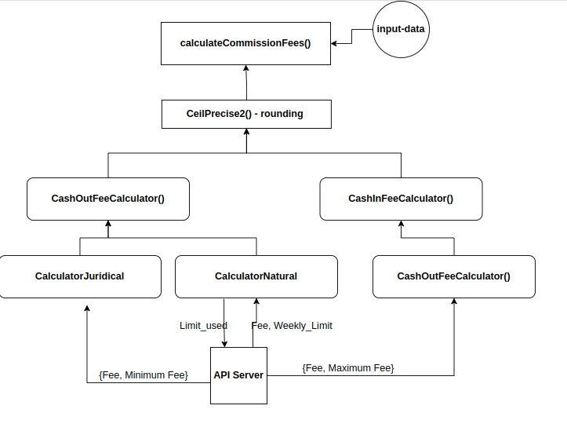

# Interview Task

It is a minimal implementation of the interview task

## Installation

Use the package manager [npm](https://www.npmjs.com/) to install dependencies.

```bash
npm i
```

## Run

there is a script for compiling typescript and running with the default input.json file, to start the script run:

```js

npm start

```

for running the tests use:

```js

npm t

```

## P.S

Diagram is like:


Due to the time limit, I tried my best, but there is so much more that can be done for this task and it is not complete.

- Some refactoring can be done and make components more reuseable
- Much more tests can be added
- Environment variables should be added
- It should be dockerized
- Pipelines can be added
- For saving the state of a paid fee to track the weekly limit a simple service can be added
- ...
